# Lab Guide Day 2

To discover even further Tanzu, visit [Tanzu Know It all](https://github.com/bdereims/tkia) git repo. 
[Cloud-Garage Blog](https://blog.cloud-garage.net/) is also good content about hybrid-cloud and gitops. 

# Introduction
This second part of this workshop is dedicated to the App Modernization topics and relies mainly on VMware Tanzu, our container management solution which is now also available on VMware Cloud on AWS as you will see during labs.

You will use user `roomXX` / `roomXX` (XX is an integer, such as 01 or 02) on jumpbox called grease-monkey. One user per group, suggested app has been extracted and based on one running on previous front-end VM. So, the main purpose is to run 2 distinct pods instead of a VM: nginx + phpfpm. The intend to do that is to leverage k8s capabilities to easily scale application depending on number of request.

# Connect to LAB Environment
In order to easily access the resources deployed in the VMC lab we will use VMware Horizon technology to access remote desktops with the necessary tools and configurations.
You can point your browser to the following URL https://horizon.semealab.cloud where a welcome screen will appear as shown below:

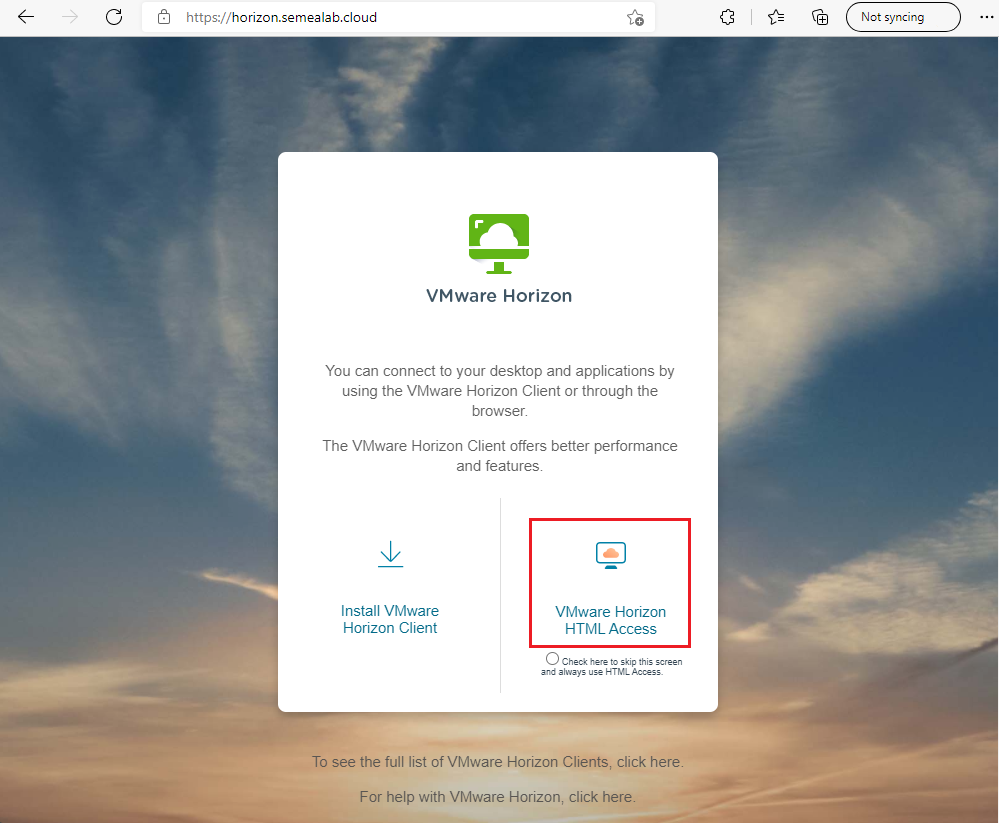

Select "VMware Horizon HTML Access" at the bottom right of the welcome screen. This will load the web client version of VMware Horizon.
When the loading process is complete we will be prompted to enter our login credentials (which will be provided by the speaker) and proceed to click on the "Login" button.

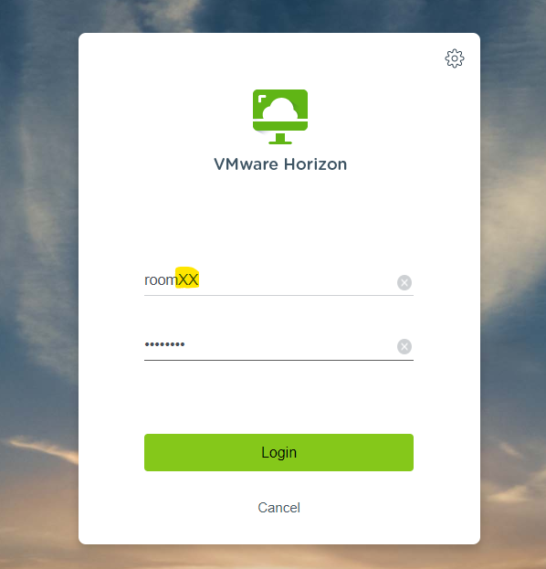

Once authenticated, you can access you desktop by clicking on the "Windows10" orange cloud icon.

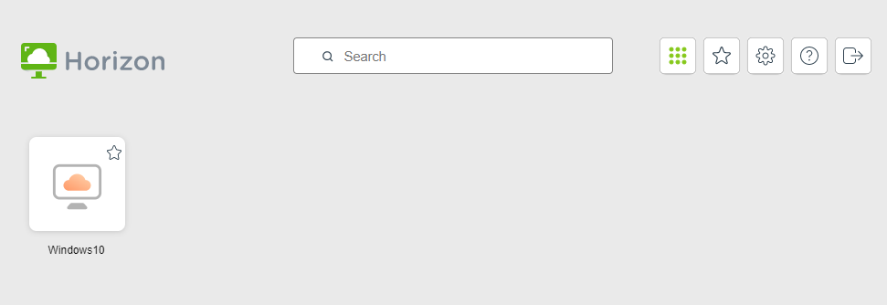

# Lab200: VMC + Tanzu
We have initiated TKG deployment in this VMC instance, roughly similar to on-premise installation.
Navigate through UI, discover how Tanzu manage K8S Workload Cluster: supervisor cluster namespaces, how to limit CPU/Memory/Storage per namespace & Cloud Native Storage. 
Tanzu offer SSO between VCSA and Kubernetes.

Worload Management Menu in VCSA: 
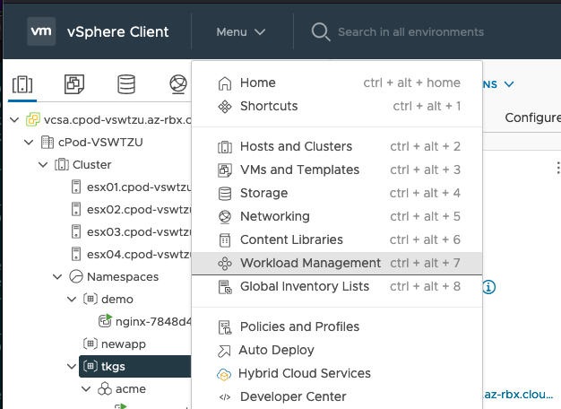

Supervisor Namespace Management:
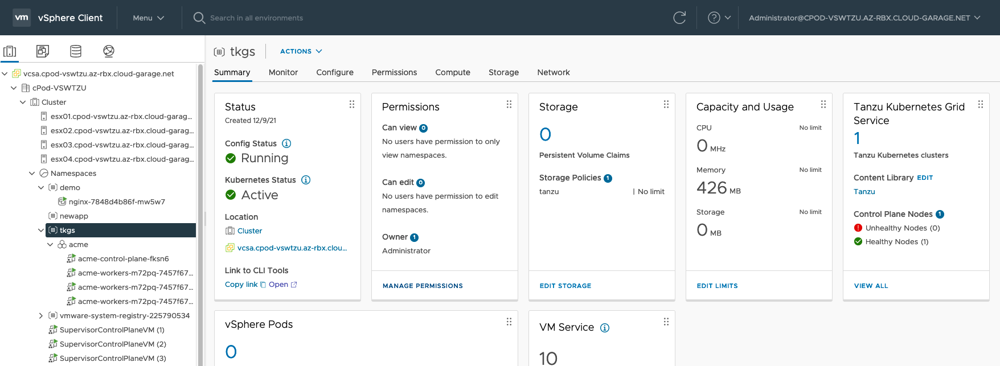

Cloud Native Storage in VCSA:
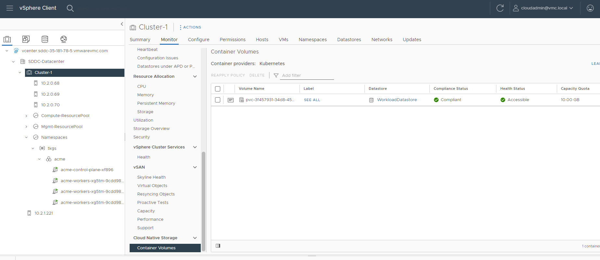

# Lab201: Discovery and setup
Log into the Grease-Monkey jumpbox. Open a command-line prompt and run the following command: `ssh roomXX@grease-monkey.vmc-tanzu.io`. 

The password is the same for the VDI.

Take time to discover directory structure, specifically `~/VMCwithHCX-Tanzu/Lab-Guide_Day2` and `~/VMCwithHCX-Tanzu/Tanzu` dirs.

As a DevSecOps team member you have access to source code of the app. Go to `~/VMCwithHCX-Tanzu/Tanzu/VMs2PODs` directory.
If you are brave enough, you can modify some artefacts like: `~/VMCwithHCX-Tanzu/Tanzu/VMs2PODs/containers/html/index.html`  
If you get lost or confused, reclone repo in order to start from scratch

It's time to build application.

# Lab202: Create registry project
Sign up with your creds `roomX` / `roomX` to [VMware Harbor](https://registry.cloud-garage.net).

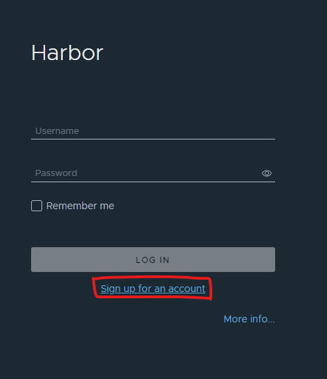

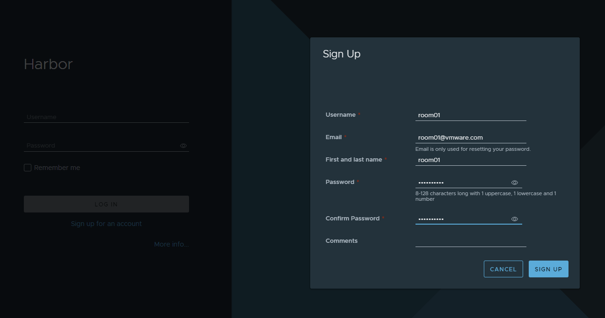

Log into and create project with name of your user, __don't forget to set it public__.

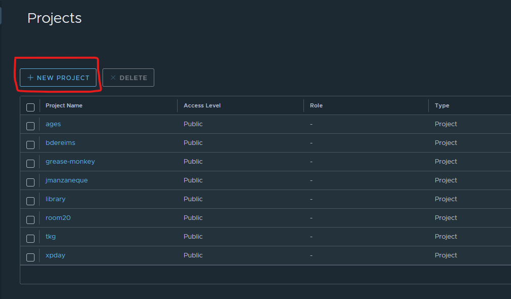

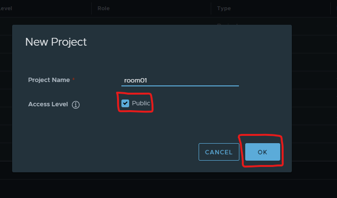

# Lab203: Build the app
Go to ~/VMCwithHCX-Tanzu/Tanzu/VMs2PODs directory.
Now, were going to build app containers. This command will build the two Docker images: acme-nginx and acme-php-fpm.
Move into the `~/VMCwithHCX-Tanzu/Tanzu/VMs2PODs/containers` and inspect the content of the two folders: nginx and php-fpm.
Inside the two folders you'll find a Dockerfile, which defines the entire Docker image:

`cat ~/VMCwithHCX-Tanzu/Tanzu/VMs2PODs/containers/nginx/Dockerfile`

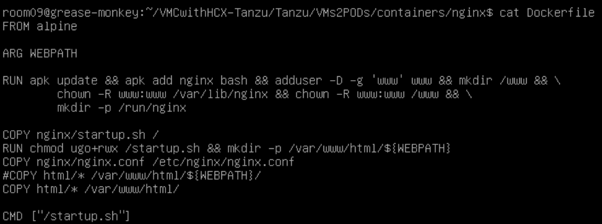

Now, run the `~/VMCwithHCX-Tanzu/Tanzu/VMs2PODs/build.sh` command. This command will run all the steps defined in the Dockerfile to build the acme-nginx and acme-php-fpm images:

Inspect your freshly created container images: `docker images`.

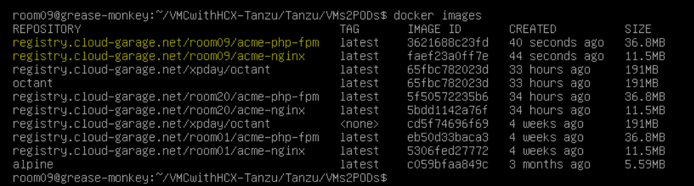

# Lab204: Push container images to registry
Log yourself to registry: `docker login registry.cloud-garage.net`. The username is roomXX and the password is the same as the VDI.

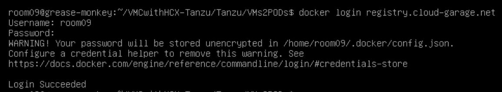

You can upload the images to the registry by running the script: `~/VMCwithHCX-Tanzu/Tanzu/VMs2PODs/push.sh`. You are invited to discover `containers/Makefile`.

Inspect the result into Harbor:

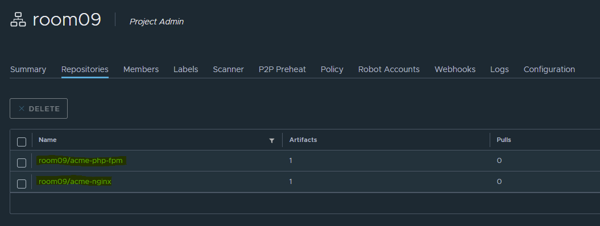

Launch a vulnerability scan against the freshly pushed images by clicking the name of each of them, selecting it and clicking on Scan:

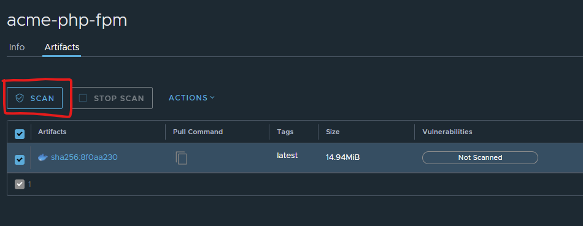

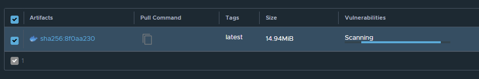

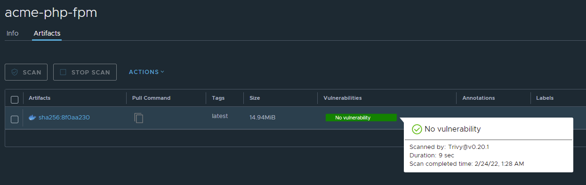

Modify your project to automaticaly scan any new pushed images and avoid deploying ones low and higher vulnerability severities.

Go to the project view and click on Configuration

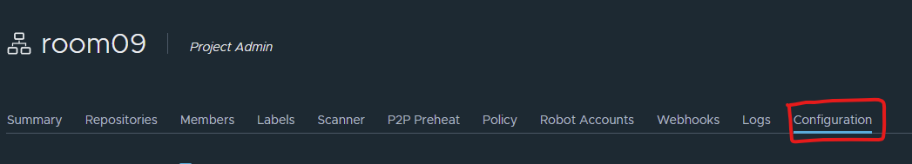

Select "Prevent vulnerable images from running". 
Select "High" as a vulnerability threshold
Select Automatically scan images on push

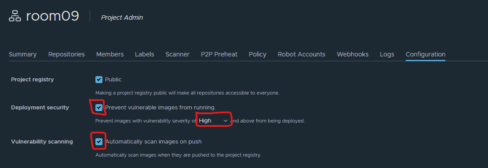

# Lab205: Deploy application
In this lab we will deploy our application from the Docker images we previously uploaded. The application will be deployed to the acme TKGs cluster deployed in VMC. 

First of all we need to log into the TKG cluster. To do so, run the `~/VMCwithHCX-Tanzu/Tanzu/tkgs/login-guest-cluster.sh tkgs acme`

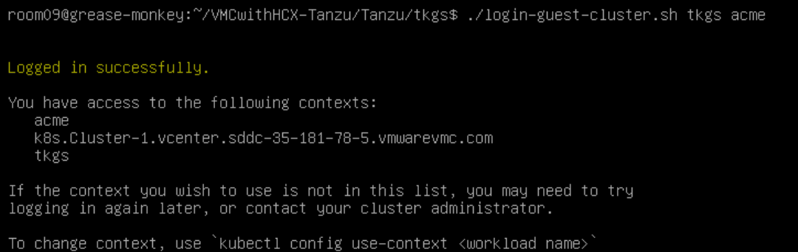

You can verify that you have logged in correctly by running `kubectl get nodes`

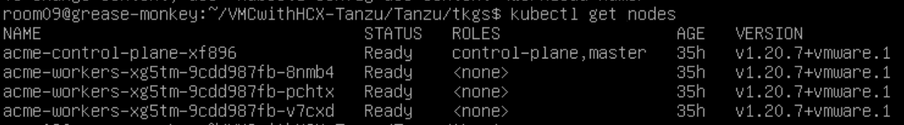

Now, deploy the application using the  `~/VMCwithHCX-Tanzu/Tanzu/VMs2PODs/deploy.sh`. This will deploy all the components for the application:

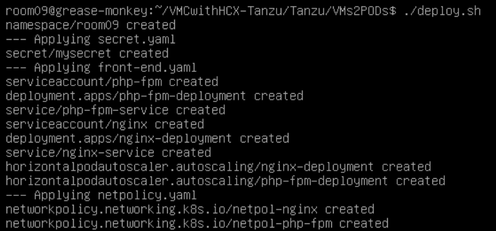

You can inspect your deployment with: `kubectl -n roomXX get pods,svc`. (Replace roomXX with your room number)

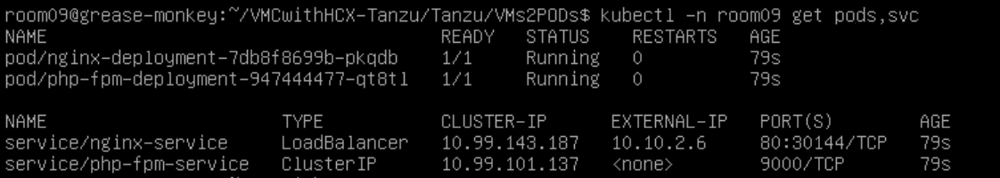

What do you conclude? Does it match with your expectations?

Inspect furthermore with: `kubectl -n roomXX get networkpolicies,hpa`.

You can find the IP for the application by running `kubectl -n roomXX get pods,svc`, under External-IP. (Your IP address might be different)

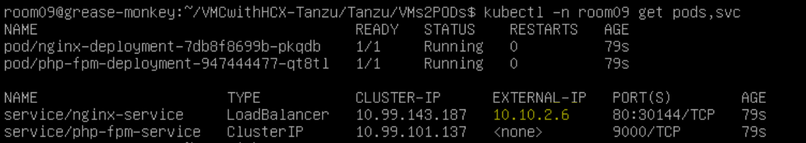

Try to access app from your favorite browser. Does it work?

*(Optional) Try to run busybox pod in your namespace and reach php page: `kubectl -n roomXX run -it --rm busybox --image=busybox -- sh` and 
What is the result? Why? *

*(Optional) The application is using the Horizontal Pod Autoscaler. Create some load with the script and discover how K8s scales pods * `~/VMCwithHCX-Tanzu/Tanzu/VMs2PODs/scale_in_pods.sh`.

# Lab206: Tanzu Management 

Tanzu offer a flexible way to manage K8s clusters, focusing on day 1 and also day 2 operations (cluster upgrading, patching, scale in/out). Because TKG uses Cluster API, the clusters are created with another Kubernetes cluster (the supervisor cluster) and therefore all is yaml.

Go to `~/VMCwithHCX-Tanzu/Tanzu/tkgs/guest-cluster` dir and discover how we deploy cluster with `create-managed-cluster.yaml`.
You can see different parameters, such as control plane and workers size, Kubernetes version, CNI and pod/services IP block

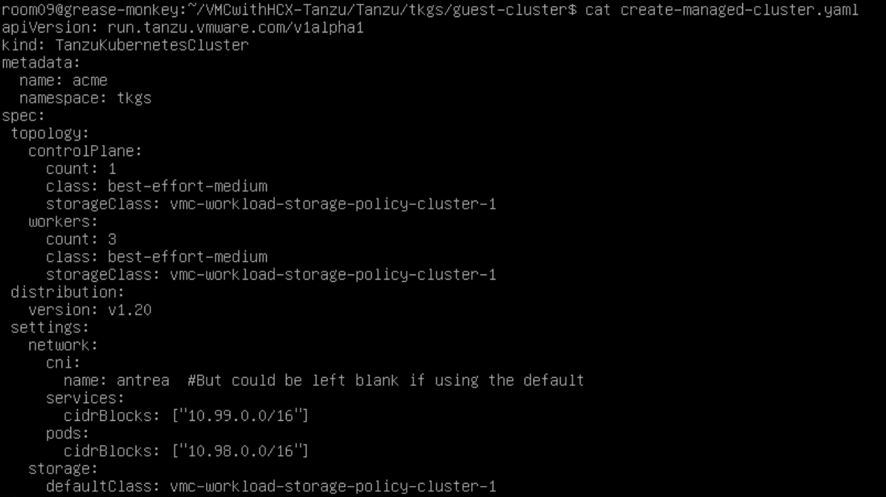

Now lets try to see how to perform day-2 operations. To do so, you need to switch to the supervisor namespace: `kubectl config use-context tkgs`

You can see the TKG cluster by typing `kubectl get tkc -A`.

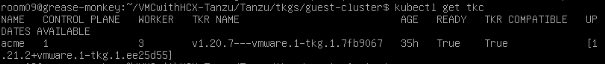
In place k8s release upgrade is possible. To do that, edit tkc item and change version accordingly to what Tanzu offer, for example: `kubectl -n tkgs edit tkc acme` and replace version.

!!! Don't modify any parameter from the cluster right now!!! 

# Lab207: Octant
VMware also provides an open source solution to manage Kubernetes objects through a graphical interface: [Octant](https://github.com/vmware-tanzu/octant). Octant is able to run on your laptop, in container or as a deployment in kubernetes.
Open a new tab in your browser and visit [Octant UI](http://octant.vmc-tanzu.io). Discover objects depending of deployed app in your namespace, try to interact within terminal console for nginx pods 

Octant, a Kube Dashboard on steroid: 
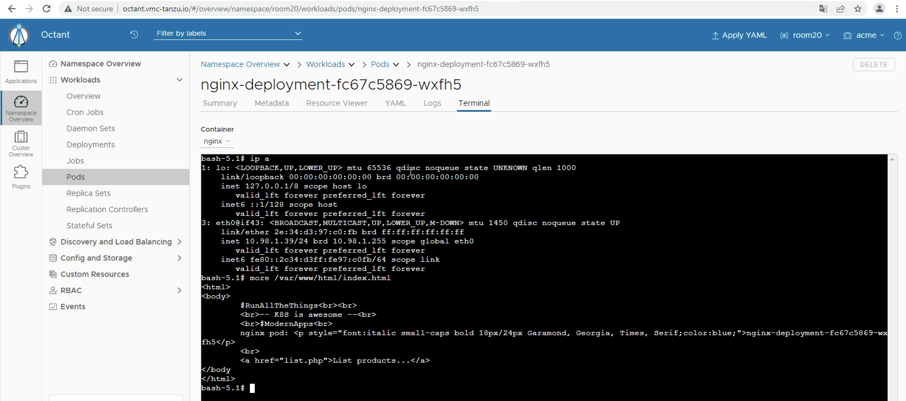

# Lab208: Tanzu Monitoring
Tanzu offers different options to monitor your Kubernetes clusters and apps. For example, Tanzu Observability (SaaS solution offering monitoring/distributed tracing/correlated events). Tanzu also includes support for Prometheus/Grafana to monitor k8s cluster and apps. 

Let's give a shot to Grafana, open a new tab in browser with: [Grafana console](http://grafana.vmc-tanzu.io:3000).
Use admin user with provided password in order to log on. Navigate to Dashboard -> Browse -> TKG Kubernetes cluster monitoring.
Data have been scapped by prometeus and presented into dashboard by grafana. Tanzu Observability uses also PromQL language to create abstracted values like prometheus, you have the choice.

Promotheus/Grafana monitoring kube cluster and apps: 
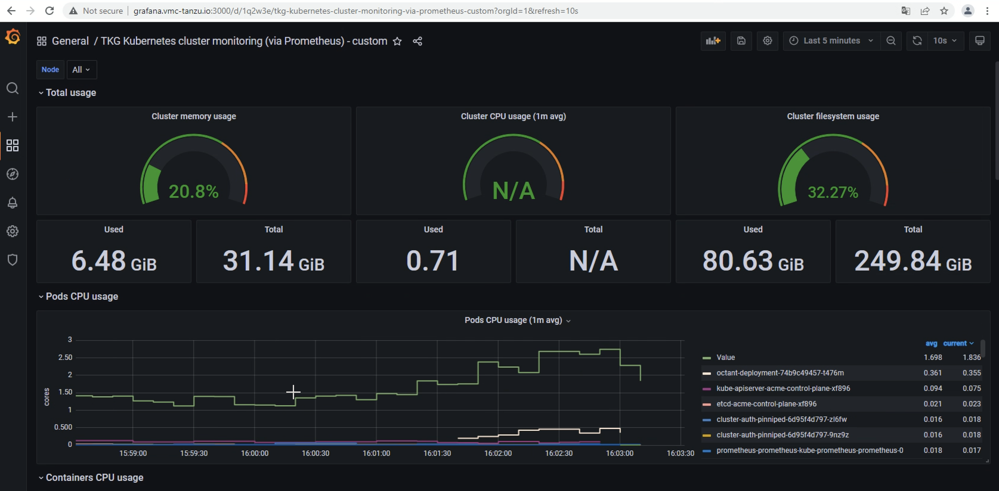

# Lab209(optional): Switching back-end VM to AWS native services
The goal is to replace VM database by RDS instance in aws.
So, create your own RDS instance. Export/Import mariadb schema in RDS. Modify env file to point to RDS instance. Rebuild/repush/redeploy app or modify your existing running app.
Is a big deal to use managed service in aws? what's about performance and lifecycle management? What's about the cost?

All script regarding DB in localized in: `~/VMCwithHCX-Tanzu/Tanzu/VMs2PODs/dbtools`  
