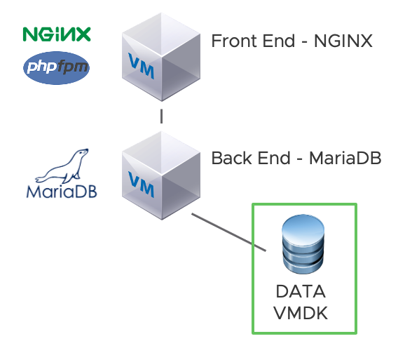
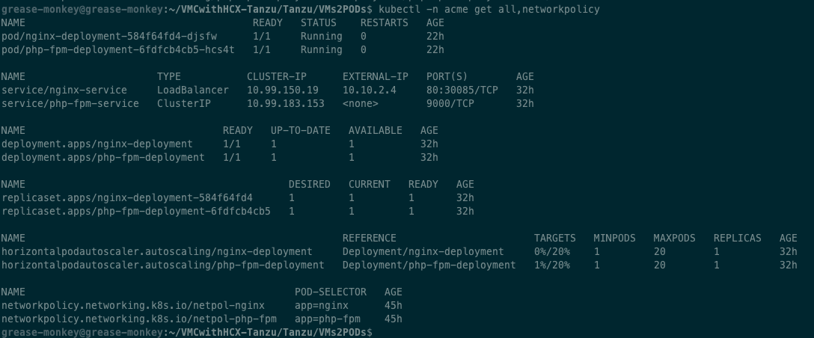
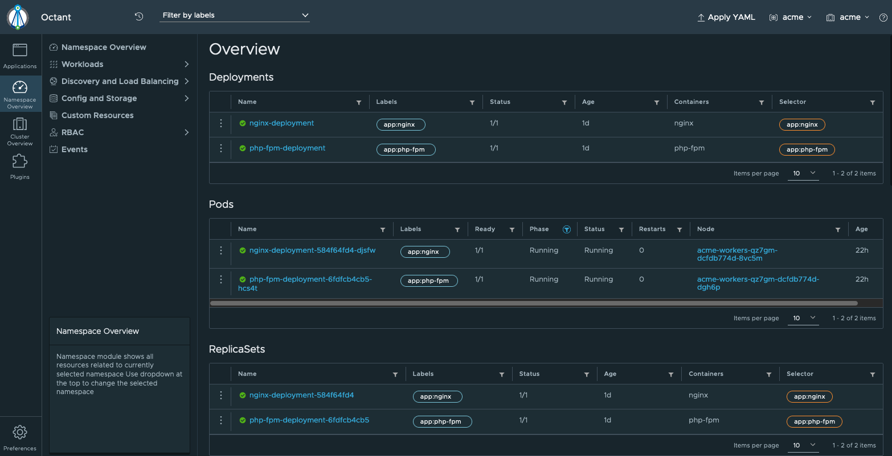
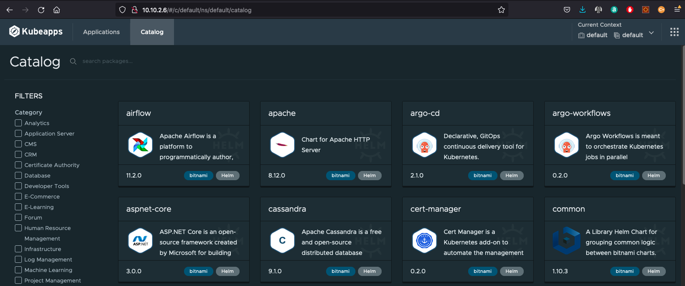

# VMCwithHCX-Tanzu
We will use these VMs in oder to demonstrate several use cases:

| Name                                                         | Purpose                                                  |
| ------------------------------------------------------------ | -------------------------------------------------------- |
| [GREASE-MONKEY](https://bucket-garage.s3.eu-central-1.amazonaws.com/VMC/GREASE-MONKEY.ova) | Jumpbox with all necessary tools                         |
| [HARBOR](https://bucket-garage.s3.eu-central-1.amazonaws.com/VMC/HARBOR.ova) | Containers & Helm Charts Repository                      |
| [FRONTEND-NGINX](https://bucket-garage.s3.eu-central-1.amazonaws.com/VMC/FRONTEND-NGINX.ova) | Frontend part of 2-tiers demo app, based on nginx+phpfpm |
| [BACKEND-MARIADB](https://bucket-garage.s3.eu-central-1.amazonaws.com/VMC/BACKEND-MARIADB.ova) | Backend part of 2-tiers demo app, based on mariadb       |

*All embeded components in VMs are opensource tools, free of charge without licence fees and free to use in respect of their opensource license.*

## Tanzu environment

### Setup and customizations

In this repo you have a directory called `Tanzu` dedicated for this section.

Step 1 - Move to `Tanzu` dir, configure your env : modify `env` and `password` accordingly to your context

Step 2 - Connect to supervisor cluster : move to `tkgs` directory, `./login.sh` helps for that

Step 3 - Create a guest cluster : move to `tkgs/guest-cluster`, review and modify `create-managed-cluster.yaml` and execute `kubectl apply -f create-managed-cluster.yaml`

Step 4 - Connect to guest cluster with `./login-guest-cluster.sh tkgs acme` in `tkgs dir`

Step 5 - Change context to guest cluster and modify psp with `kubectl apply -f allow-runasnonroot-clusterrole.yaml` in `guest-cluster` dir

Step 6 - Now you are ready to install `octant` and `kubeapps`, just follow script in corresponding dir

### Use case

ACME use case is a 2-tiers app running in two distinct VMs, monolithic approach. App is quite difficult to maintain, upgrade and scale. Now, we want to shift building blocks into kubernetes in order to save ressources and to bring more flexibility.

Build from Dockerfile, kube yaml, push to harbor and deployment in kube are all automated. Scripts are localized into `VMs2PODs` dir.

We have used same artefacts in VMs, technical speaking app in kube is the same, It has been decoupled in "microservice" like and leverage containers ochestration. This example comes also with `HorizontalPodAutoScaling` and `NetworPolicy`. 

This example is volontary simple, easy to modify, esay to understand. We want to stay with KISS principle.

### Labs

`env` file contains all variables used to build and run this app. You can modify it in your convenience.

Main goal is to move app from VMs to Pods in kube.

The source:

The target:

<u>Let's do that:</u>

Step 1 - Move to `VMs2PODs` dir, Build app containers with `./build.sh`

Step 2 - Push containers to HARBOR with `./push.sh`

Step 3 - Deploy components with ./deploy.sh

Step 4 - Inspect deployment with `kubectl -n acme get all,networkpolicy` or with `octant`

Step 5 - load and scale app with `./scale.sh` inspect the result in `octant` if you like it

Step 6 - Play with kubeapps to deploy and manage lifecycle of apps

Step 7- Play with TMC to discover how to manage guest cluster

